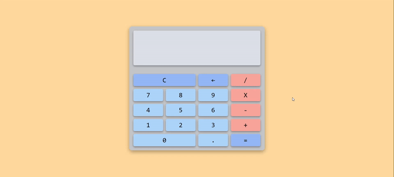

<h1 align='center'>🌟 Página Calculadora 🧮🌟</h1>

> Practica de HTML, CSS y JavaScript. ✨

🎯 Objetivo: Crear una página calculadora.

Esta idea de proyecto está inspirada en los videos "CALCULADORA EN 1 LÍNEA DE CÓDIGO | CALCULADORA EN 5 MINUTOS | JAVASCRIPT" de Anthony Zabs ([ver video](https://www.youtube.com/watch?v=liBiDMUVfR4 "ver video")) y "Crea 7 Proyectos con HTML, CSS y JavaScript - Curso Práctico" de FreeCodeCamp Español ([ver video](https://youtu.be/BA328RQa08M?si=5ufWXesJHY-epQta "ver video")). Aunque me guié por las ideas presentadas en estos videos, he desarrollado esta página calculadora a mi manera, añadiendo mis propios enfoques y personalizaciones.

------------

### Instalación 🛠️💻

Sigue estos pasos para clonar y ejecutar el proyecto localmente:

1. Clona este repositorio en tu máquina local utilizando Git:

    ```bash
    git clone https://github.com/Schugu/calculator.git
    ```

2. Navega al directorio del proyecto:

    ```bash
    cd calculator
    ```

3. Una vez clonado el repositorio en tu máquina local, abre el archivo `index.html` en tu navegador web para ver el proyecto.

4. Si deseas personalizar los estilos de la página, puedes hacerlo modificando el archivo `styles.css`. Este archivo contiene todas las reglas de estilo que se aplican a la página. Abre el archivo `styles.css` en un editor de texto o IDE de tu elección, realiza los cambios que desees y guarda el archivo. Luego, recarga la página en tu navegador para ver los cambios aplicados.

5. Si deseas modificar o entender cómo funciona la página, te recomendamos revisar el archivo `app.js`. Este archivo contiene el código JavaScript que hace funcionar la calculadora.

------------

### Capturas de pantalla 📸

